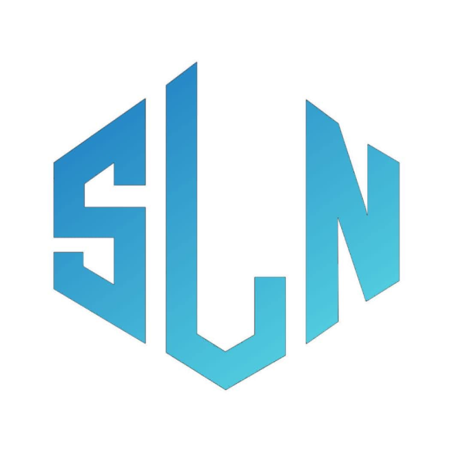

 

<h1> CarSLN
        
        
</h1>
<a> Revolutionize the way you Buy, Sell, or Lend your Car! all While making Automotive Transactions more Seamless and Hassle-Free. </a>

 
 
 

<h1> Moreover 
        
</h1>

CarSLN is my Current App Project For Selling and Lending Cars as well as Negotiating with Sellers All over the Country to Purchase and Obtain the Car you've been Looking for!

First and Foremost, CarSLN is an Android App Written in Java and is Currently being Developed in Android Studio, and Hopefully it will be Listed on the Play Store Later On.

Noteable CarSLN Features:

- Animated Splash Screen and Loading Screens
- Custom Car Search and SearchList with Sorting
- Extensive Car Attributes and Photos for All Car Listings
- Multiple Ways Of Contacting Car Sellers (Call, Message, Whatsapp)
- Car Bookmarking for Cars that interest you or Cars that you might Need Later On
- Login with Custom Users and Custom Attributes (Username, Phone Number, ProfilePhoto)
- Fully Fledged Car Adding Page with Lists of all Available  Car Manufacturers and Car Models
- User Oriented Home Screen that Will Help you Navigate Through the App and Potentially Find Your Desired Car
- Full Control Over User Info and Attributes and Car Listings Through a Separate Profile, Settings and Edit Post Screens

 

<h1> About  Me & the Journey </h1>

<a> I Consider myself a Deticated and Passionate Computers Enjoyer. I always loved Messing around with Computer Parts and Typing Code from a very Young age.
and This App might as well be the Biggest so Far in my Journey of Becoming a Real Computer Engineer! </a>

<a> I began Working on this App as early as the end of September or in other words nearly the Start of 12th Grade, it was Rough at the Begining but i made it here at last after many challenges and obstacles....... </a>

<h4> Many Thanks to my Teacher
        
</h4>

 

<h1> Contact </h1>

<h4> 📧 Email Adress:
        <a href="mailto:tawfeeqshahoud@gmail.com"> tawfeeqshahoud@gmail.com </a>
</h4>

<h4> 💬 Discord Username: 
     <a href="https://discord.com/"> tender_xd </a>
</h4>

